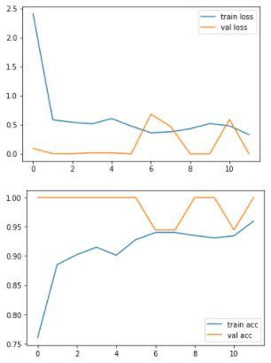

# Cotton-Disease-Prediction

## Objective

This is an image classification project to classify whether the image is of a diseased or fresh cotton plant/leaf. There are 1951 images present in the train dataset belonging to one of the four classes.

The aim is to build an image classifier to correctly classify the images in the train dataset. I have used InceptionV3 transfer learning model for my project. I have trained this model in Google Colab.

The dataset can be downloaded from : https://www.kaggle.com/janmejaybhoi/cotton-disease-dataset

## Brief Overview of steps followed in the project

* Checked for the GPU available for training and Tensorflow version
* Imported the libraries
* Initialised the model without including the top layer
* Made the layers non-trainable
* Added a dense layer with nodes equal to number of classes present
* Used Image data generator to implement image augmentation
* Fit the model and plot the accuracy

